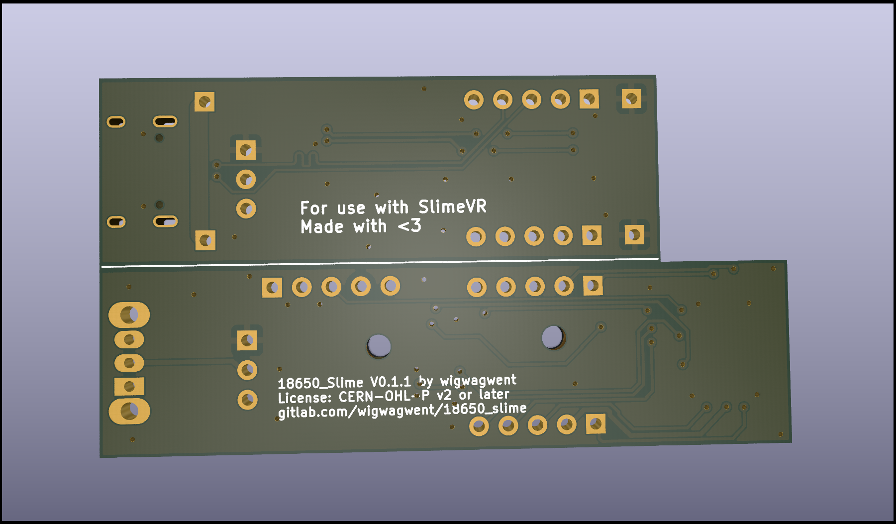
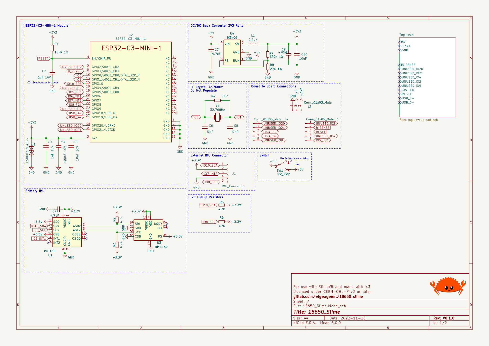
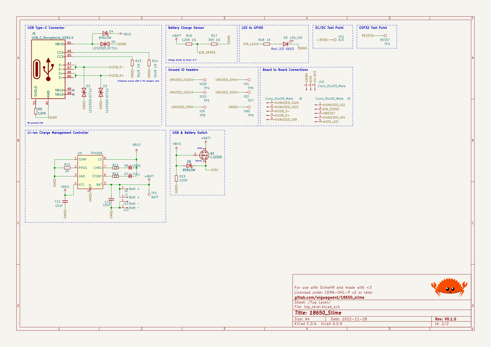
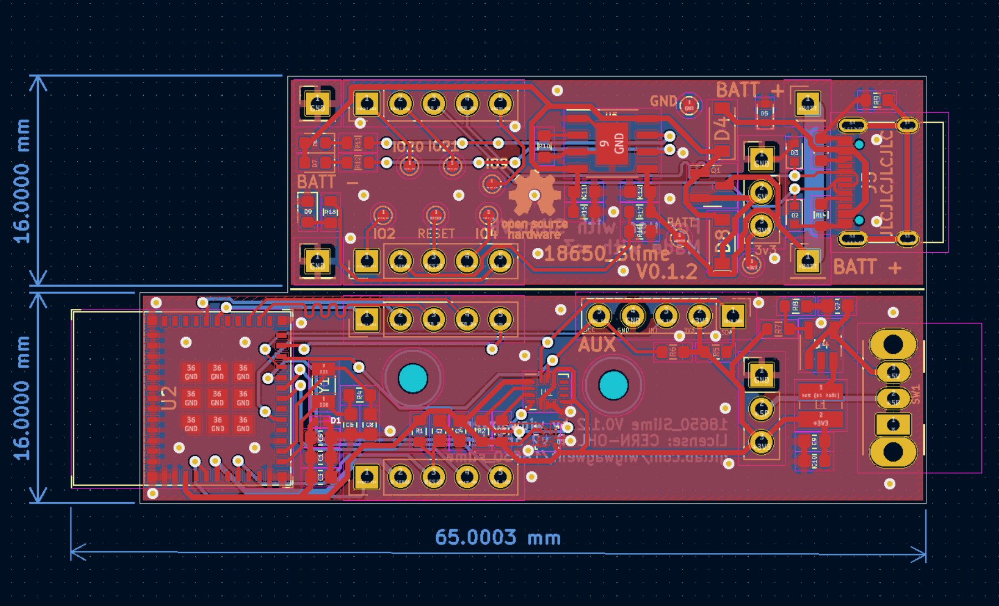

# 18650 SlimeVR
This PCB is designed to be about the same size as a 18650 cell once fully assembled
and stacked. This is a stacked board design but in theory, all the hardware should
be able to fit onto one board.

## Useful Information
- IMU: BMI160 with BMM150
- ESP32-C3 main processor

**Note:** BMM150 is not supported in slimevr yet.

## Renders

## Changelog
A description of the changes in each revision can be found [here](CHANGELOG.md).

## Credits
The schematic was based on version 3.0 of the .
Big thanks to TheButlah for all the work he put into this schematic and into slimevr.
