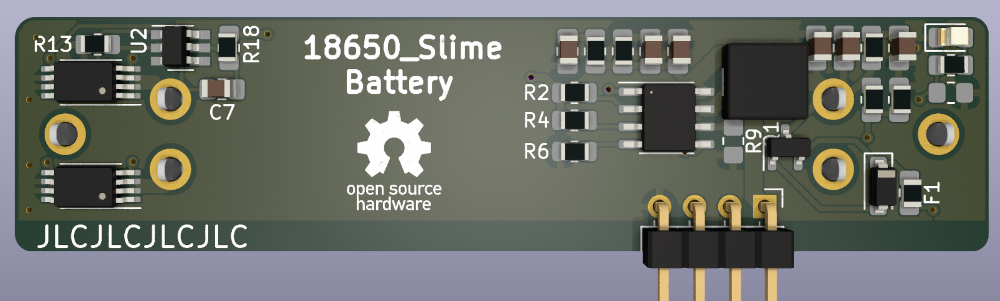
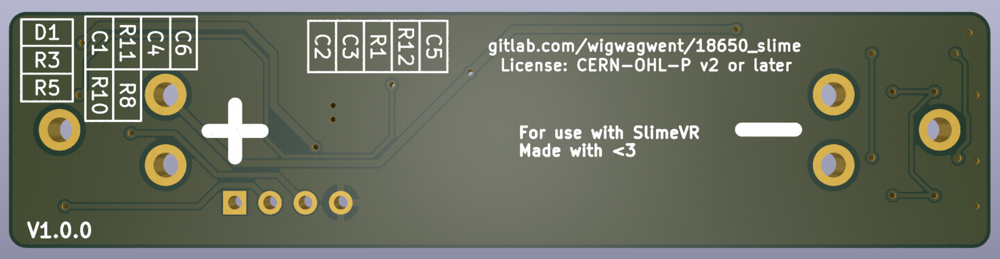
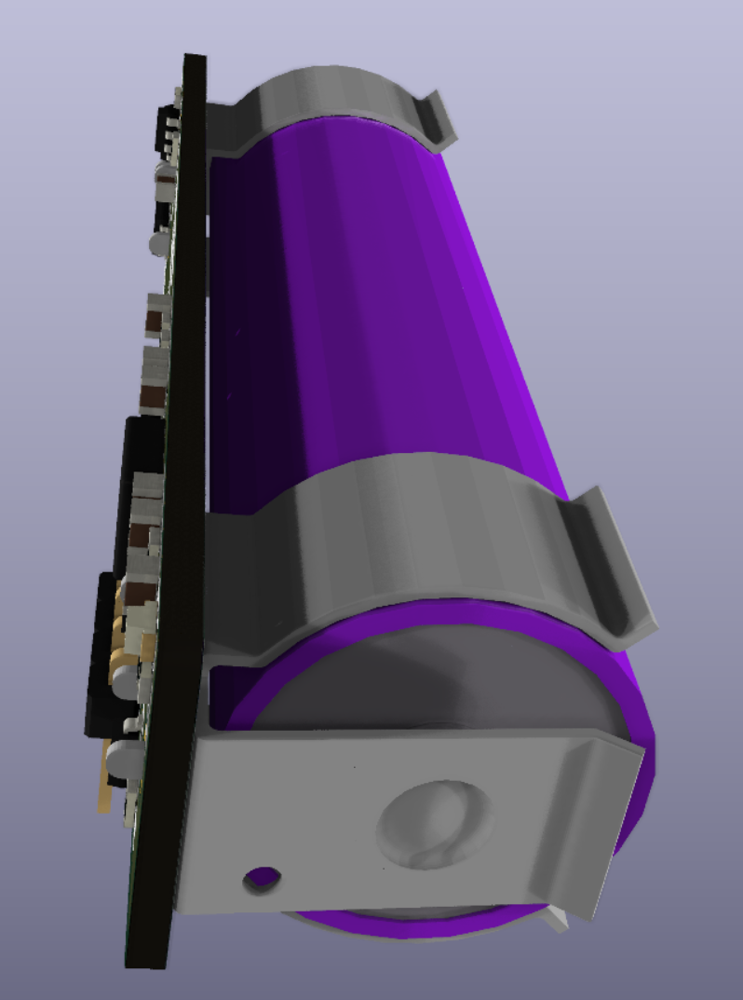
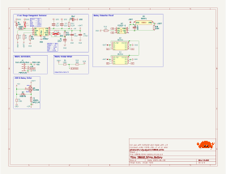
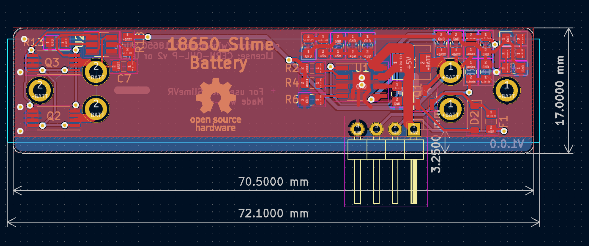

# 18650 SlimeVR Battery
This PCB is designed to be about the same size as a 18650 cell and contains all the charging and protection
circuitry for that one cell. It has under/over voltage, over current through a 350mA resettable fuse, and short 
circuit protection. It supports charging rates up to 3A with the current setting being 2.1A.

## Renders

## Changelog
A description of the changes in each revision can be found [here](CHANGELOG.md).
