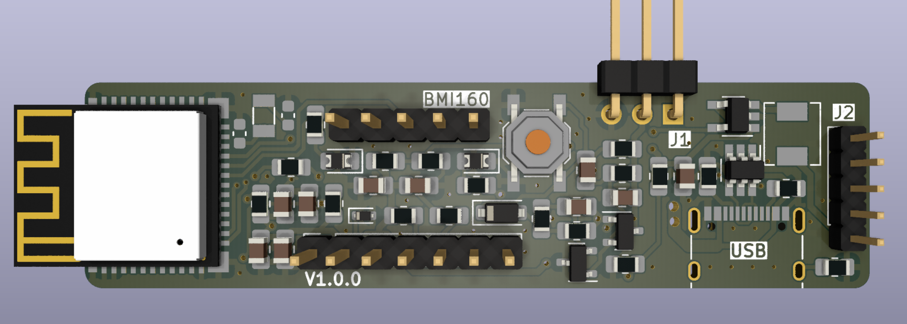
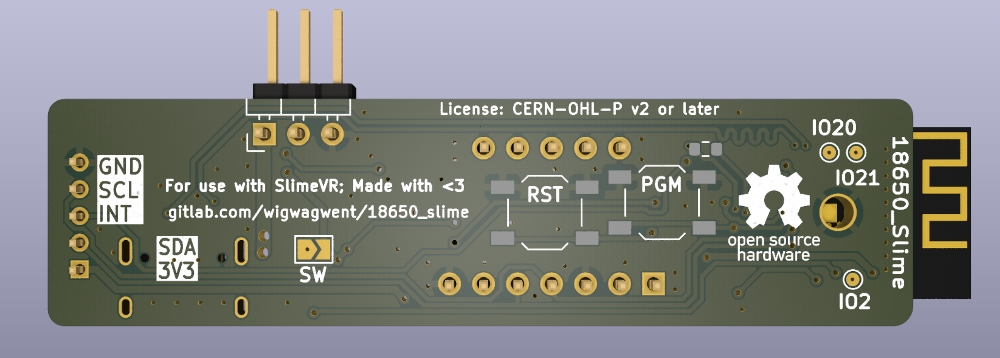
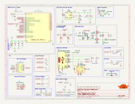

# 18650 SlimeVR
This PCB is designed to be about the same size as a 18650 cell once fully assembled
and stacked. This is a stacked board design but in theory, all the hardware should
be able to fit onto one board but is separated to two boards.

## Useful Information
- IMU: BMI160 Module
- ESP32-C3 main processor

## Renders

## Changelog
A description of the changes in each revision can be found [here](CHANGELOG.md).

## Credits
The schematic was based on version 3.0 of the .
Big thanks to TheButlah for all the work he put into this schematic and into slimevr.
Also big thanks to Mosaic-Industries for there push button 
Final thanks to this github project that implements a usefull  for jlcpcb

